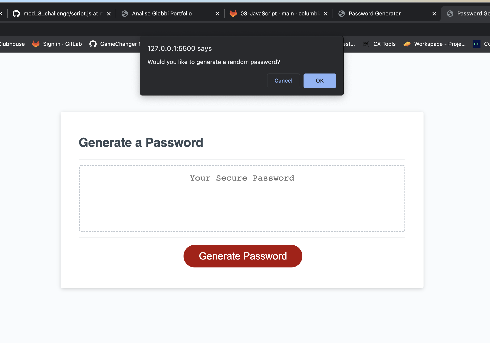
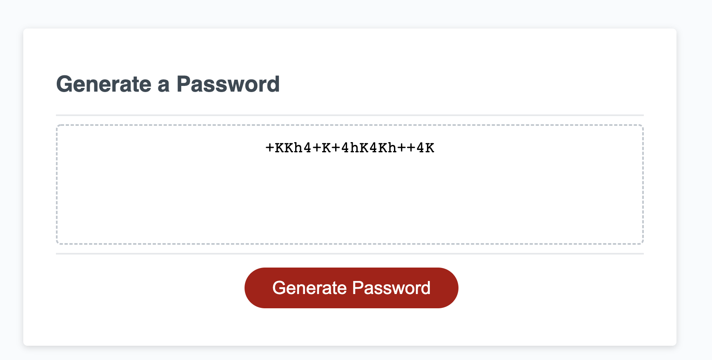

# 03 JavaScript: Password Generator

## Description
The password generator allows a user to clikc the generate password button and be taken through prompts that will generate a random password with a lower case letter, upper case letter, character, and number. The user can choose the length of the password and from any array the criteria, math operators will pic random indices. The final result is a randomly generate password, which displays in the UI. 

## User Story

```
AS AN employee with access to sensitive data
I WANT to randomly generate a password that meets certain criteria
SO THAT I can create a strong password that provides greater security
```

## Acceptance Criteria

```
GIVEN I need a new, secure password
WHEN I click the button to generate a password
THEN I am presented with a series of prompts for password criteria
WHEN prompted for password criteria
THEN I select which criteria to include in the password
WHEN prompted for the length of the password
THEN I choose a length of at least 8 characters and no more than 128 characters
WHEN asked for character types to include in the password
THEN I confirm whether or not to include lowercase, uppercase, numeric, and/or special characters
WHEN I answer each prompt
THEN my input should be validated and at least one character type should be selected
WHEN all prompts are answered
THEN a password is generated that matches the selected criteria
WHEN the password is generated
THEN the password is either displayed in an alert or written to the page
```

## Mock-Up

The following image shows the web application's appearance and functionality:


The following window prompt will appear:



The final result will be a randomly generated password:


## Link
[Random Password Generator](https://analisegiobbi3.github.io/mod_3_challenge/)
